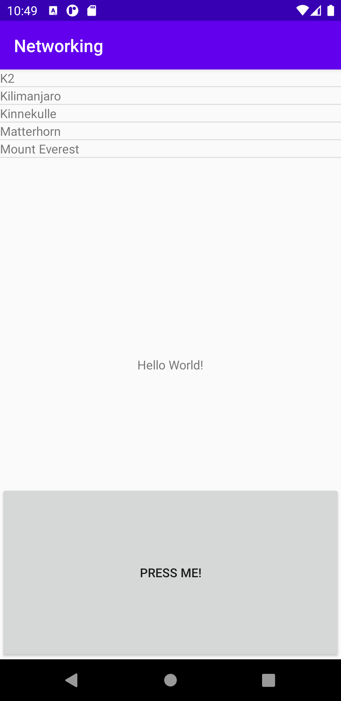
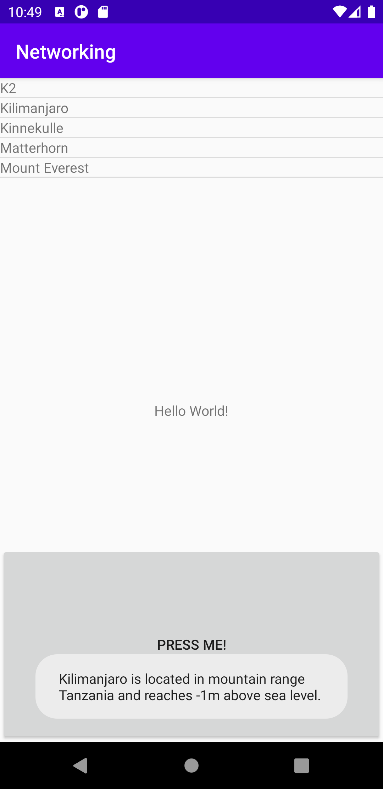

# Rapport

**Rapport Dugga 6**


**Steg 1.**

Var att skapa en ListView i main_activity filen, så att datan som kommer läsas in från json hamnar i en lista.

```xml
<ListView
   android:id="@+id/list_V"
   android:layout_width="match_parent"
   android:layout_height="match_parent"
   app:layout_constraintStart_toStartOf="@+id/textView2"
   />
```
Och en ny layout för TextVview.
```xml
<TextView xmlns:android="http://schemas.android.com/apk/res/android"
   android:layout_width="match_parent" android:layout_height="match_parent"
   android:id="@+id/text_T"
   >
```
**Steg 2.**

var att skapa en java fil för den data vi vill kunna hämta ut.

Först deklareras de olika variablerna
```java
public class Mountain {
   private String name;
   private String location;
 private int height;
```
Sedan en funktion som tar emot datan för variablerna
```java
public Mountain(String n,String l,int h)
{
   name=n;
   location=l;
   height=-1;

}
```
En funktion som kommer returna texten för med de olika variablerna.

```java
public String info(){
   String tmp=name+" is located in mountain range "+location+" and reaches "+height+"m above sea level."; //Lägger in datan från tidigare funktion till en sträng.
   return tmp;
}
```

Tillslut så skapas en toString för att se hur vår json fil skulle se ut i en fil, och istället för att visa vad rå datan så presenterar vi datan med variabeln name istället.

```java
@Override
public String toString(){  //Tar och visar namnet istället för vad som annars står.
   return name;
}
```
**Steg 3.**

Är att skapa en array till en lista i MainActivity
```java
public ArrayList<Mountain> mountainArrayList=new ArrayList();
```
Här skapas en adapter som knyter samman list_item_textview.xml filen som skapades i layout tidigare, samt TextView filens id som finns i xml filen, samt vår array.
```java
adapter=new ArrayAdapter<Mountain>(this, R.layout.list_item_textview,R.id.text_T,mountainArrayList);
```
Vi skapar också en variabel för våran listview,  och döper den till “my_listview” och som är kopplat till våran listview. Till slut så säger vi att vår variabel “my_listview ska ta emot data från våran adapter.
```java
ListView my_listview=(ListView) findViewById(R.id.list_V);
my_listview.setAdapter(adapter);
```

**Steg 4.**

Var att skapa en onClicklistener som lyssnar på vilket item i vår array som visas i listview som vi trycker på. Här har jag också lagt till en toast som kommer visa information om den “listan” vi tryckt på.
```java
my_listview.setOnItemClickListener(new AdapterView.OnItemClickListener(){
   @Override
   public void onItemClick (AdapterView<?> parent, View V, int position, long id) {
       Toast.makeText(getApplicationContext(), mountainArrayList.get(position).info(),Toast.LENGTH_SHORT).show(); //Skriver ut värdet i mountainArraylist.

   }
});
```

**Steg 5.**

Hämtar den angivna koden och lägga in i mainActivity, som kommer hämta vår jason data i bakgrunden.
```java
@SuppressLint("StaticFieldLeak")
private class JsonTask extends AsyncTask<String, String, String> {

   private HttpURLConnection connection = null;
   private BufferedReader reader = null;

   protected String doInBackground(String... params) {
       try {
           URL url = new URL(params[0]);
           connection = (HttpURLConnection) url.openConnection();
           connection.connect();

           InputStream stream = connection.getInputStream();
           reader = new BufferedReader(new InputStreamReader(stream));

           StringBuilder builder = new StringBuilder();
           String line;
           while ((line = reader.readLine()) != null && !isCancelled()) {
               builder.append(line).append("\n");
           }
           return builder.toString();
       } catch (MalformedURLException e) {
           e.printStackTrace();
       } catch (IOException e) {
           e.printStackTrace();
       } finally {
           if (connection != null) {
               connection.disconnect();
           }
           try {
               if (reader != null) {
                   reader.close();
               }
           } catch (IOException e) {
               e.printStackTrace();
           }
       }
       return null;
   }

```

**Steg 6.**

Skapa en knapp som kommer att låta oss hämta och refresha json datan genom ett knapptryck. Då vi inte vill ha en konstant uppdatering så väljer vi istället att uppdatera genom att låta den tidigare givna koden köras när knappen blir aktiverad.
```java
Button finalButton = findViewById(R.id.button1); //laggt in knappen i java filen.
finalButton.setOnClickListener(new View.OnClickListener() {
   @Override
   public void onClick(View v) {
       new JsonTask().execute("https://wwwlab.iit.his.se/brom/kurser/mobilprog/dbservice/admin/getdataasjson.php?type=brom");
   }
});
```
**Steg 7**

Lagt till permission i AndroidManifest.xml filen så vi kan komma ut på nätet med vår applikation.
```java
<uses-permission android:name="android.permission.INTERNET"/>
```


**Steg 8**

Sedan för att parsa json datan så har jag använt mig av kod i tidigare föreläsning.
Här används try för att alltid testa koden för fel när den körs. Om något inom try taggarna blir fel så kommer catch att skriva ut vår Log.d

I try blocket så clearar vi först vår mountainArraylist.
Sedan skapar vi en ny variabel “jsonArray” som innehåller den nya textsträngen som vi plockar in i vår onPostExecute.
Vi itererar sedan datan och hämtar ut de valda objekten “name”, “location”, “size”
Till slut så skapar vi en variabel som innehåller den nya informationen och sedan lägger den datan i våran mountainArrayList.
```java
try {
   mountainArrayList.clear();
   JSONArray jsonArray = new JSONArray(json);
   for (int i = 0; i < jsonArray.length(); i++) {
       JSONObject jsonObject = jsonArray.getJSONObject(i);

       String name = jsonObject.getString("name");
       String location = jsonObject.getString("location");
       int height = jsonObject.getInt("size");

       Mountain mountain = new Mountain(name, location, height);
       mountainArrayList.add(mountain);
   }
   adapter.notifyDataSetChanged();

   }

   catch (JSONException e) {
       Log.d("JSON", "Could not parse: " + json + "\n due to expectation:" + e);
```

Bild 1(efter att ha tryckt på knappen eftersom listan först är tom)


Bild 2(Efter att ha tryckt på ett av bergen så kommer toasten upp)


